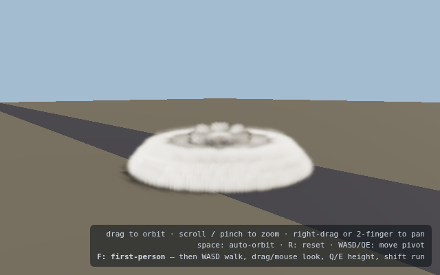
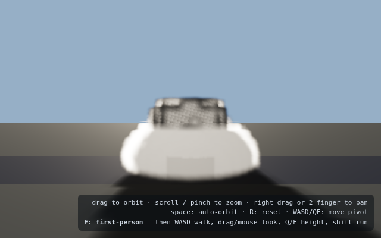
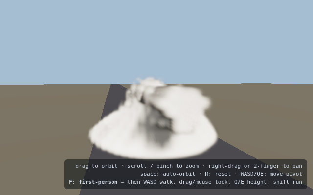
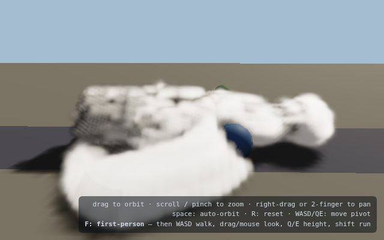
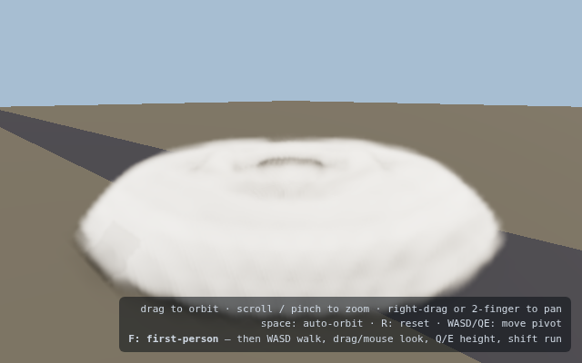
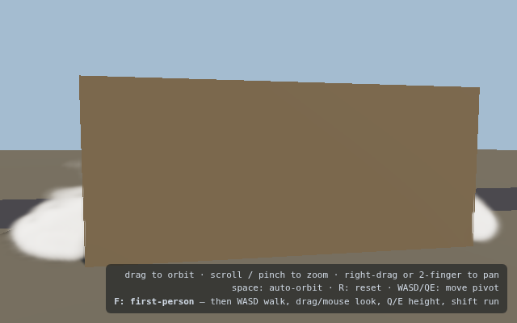
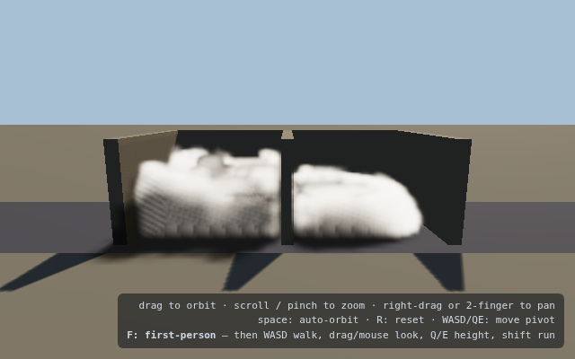
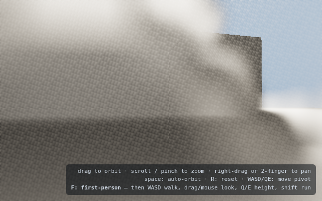
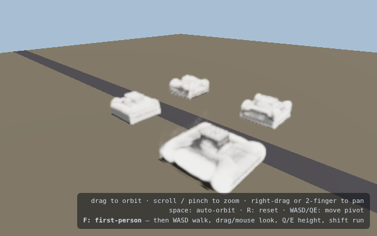
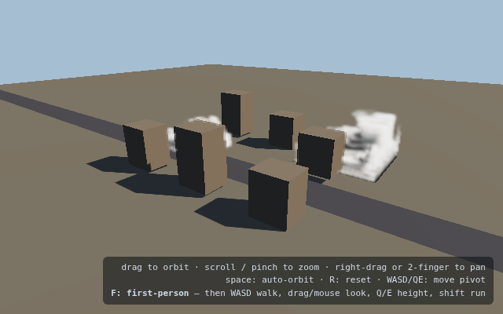

# volumetric-world

Real-time dust / smoke volumetric simulation for **three.js + WebGPU**:

> Pooled world-space MAC-grid simulation islands with moving convex boundaries, fixed-budget pressure projection, advective lower-rate rendering, anisotropic persistent volume packets, and a half-resolution temporally reconstructed physically based renderer.

This is a **multi-scale, world-space participating-media engine**, not a particle effect and not one independent fluid box per cloud:

```text
Physics snapshots + crush/fracture events
                    │
                    ▼
        Spatial source/collider binning (CPU broad-phase → per-island uniforms)
                    │
          ┌─────────┴─────────┐
          ▼                   ▼
 Near/mid fluid islands   Far-field packets
 MAC incompressible grid  anisotropic 3D Gaussians (CPU, ~10 Hz)
 pooled slots, 15–30 Hz   split/merge/wind/wakes
          │                   │
          └─────────┬─────────┘
                    ▼
   Shared 3D texture atlas + packet uniforms
                    │
                    ▼
 Half-resolution temporal volumetric raymarch → depth-aware composite
                    │
                    ▼
                60 FPS canvas
```

**Live demo:** deploy `dist/` anywhere static (a `vercel.json` is included) and open in Chrome/Edge with WebGPU. Simulation state is world-space: a car hidden behind a building keeps stirring the cloud you *can* see — visibility affects render priority, never simulation participation.




| | | |
|---|---|---|
|  |  |  |
|  |  |  |
|  |  | |

## Running

```bash
npm install
npm run dev          # http://localhost:5173/?scene=puff&preset=medium
npm run build        # tsc + vite build → dist/
npm test             # Playwright: real-browser WebGPU tests (headless Chromium + SwiftShader)
npm run screenshots  # regenerates docs/screenshots/*.png
```

Requires WebGPU (Chrome/Edge 121+, desktop GPU recommended). On Linux launch Chrome with `--enable-unsafe-webgpu --enable-features=Vulkan`. Scene/quality picked via URL: `?scene=cityblock&preset=high`.

## What is new in V2 — "one cohesive medium"

The V1 engine proved the physics; V2 makes the multi-scale machinery read as
ONE medium and allocates fidelity **relative to the viewer**:

- **Viewer-centric LOD**: the island pool is mixed-resolution (2 fine + 2
  coarse slots; coarse ≈ half res = 1/8 the cells at 0.6× the rate). The
  scheduler's `focusMode` (default `camera`, HUD toggle / `?focus=events`)
  assigns fine slots and high rates near the viewer and re-tiers islands **in
  place** as the camera moves: a GPU "rebox" kernel resamples the old slot's
  atlas region into a new slot (density, optics, velocity — no CPU readback,
  no packet round-trip) under a 0.3 s crossfade. Try the `avenue` scene
  (~300 m, staggered collapses, a car driving through) and walk it in
  first-person (F).
- **Seamless grid↔packet handoff**: exports now carry the plume's actual
  momentum (a `kDownsampleMomentum` grid feeds mass-weighted group velocities)
  at 4³ moment groups (structure, not one dome); promotion crossfades (island
  fades in while its consumed packets fade out on a render-only list). Islands
  and packets share ONE detail-noise field (same material-driven world-space
  scale, same erosion) so the texture is continuous across a handoff.
- **Renderer scalability**: segmented ray march (per-volume intervals, sorted
  + clipped, steps allocated with a near-field bias) instead of one union
  interval; CPU-binned per-screen-tile packet lists (the per-sample loop sees
  ~a few packets, not all 96); O(N³) directional light sweep replacing the
  O(N³·steps) per-voxel march (~14× fewer fetches, no per-voxel jitter
  speckle) with a 16-bit fixed-point transmittance cache (no more banding).
- **Film-style translucency**: self-shadow marches run at a configurable
  fraction of the primary extinction ("shadow density", default 0.35), plus
  soft-knee extinction, ~1.2 m world-space island edge fade, depth-aware
  upsampling of the half-res volume, and a softened detail response.
- **Conservation**: packet budget folds overflow into neighbours instead of
  deleting it; promotion returns un-voxelized packets to the pool; merge
  blends optics linearly (was cubically biased); emission ownership guarantees
  a source injects into exactly ONE island; heavily overlapping islands
  resolve by retiring the less important one.
- **Working GPU telemetry**: `timestamp-query` resolution was dead on real
  hardware (a three r180 API move); the quality controller now actually sees
  GPU ms — check the debug report button.

## What is implemented (V1)

### Simulation core — `src/webgpu/`
- **Staggered MAC grid** per island: face-centered `u,v,w`, cell-centered pressure, dust loading, and *additive optical moments* (σt RGB + loading, σs RGB + scattering-weighted phase moment) so mixed materials (concrete + drywall + …) blend per voxel without per-material grids.
- **Per-step pipeline** exactly as specified: collider rasterization → dust/momentum injection → RK2 semi-Lagrangian velocity advection → forces (cold-dust density loading `f = −g·k·ρ_dust ŷ`, ambient-wind coupling, vorticity confinement) → divergence with **moving solid boundary velocities** → fixed-budget pressure solve → projection → **MacCormack density advection** with monotonic neighborhood clamp → render-volume bake → staggered per-island **sun-transmittance cache**.
- **Mass renormalization**: gather-based semi-Lagrangian advection is not conservative, so each step rescales committed density by (pre-advection mass / post-advection mass), bounded to [0.55, 1.8]. Total mass then changes only through dissipation and grid→packet export (verified by tests).
- **Dynamic colliders**: sphere / box / capsule analytic distances, convex hulls via inward plane lists, compounds flattened CPU-side each step; boundary velocity `v + ω×r` enters divergence and projection so moving slabs displace air. Bodies also inject **swept-capsule wakes** (prev→current transform) scaled by speed and drag coefficient — the doc's explicit vehicle wake term.
- **Flow effectors**: jet, vortex ring, wind volume, impulse.
- **Island lifecycle**: pooled fixed-resolution slots (tier varies world extent + step rate), integer-voxel **scrolling** that follows the tracked focus, boundary **shell export** into packets, retirement→packet handoff with crossfade, and packet→grid **promotion** (Gaussian revoxelization of both density and velocity).

### Far field — `src/core/packets.ts`
World-space **anisotropic Gaussian volume packets** (true 3D media: enterable, occluded, lit, revoxelizable — not sprites). Low-rate CPU evolution: wind drag, covariance growth, ground pancaking, split/merge, dissipation, analytic body wakes while off-screen.

### Rendering — `src/three/volumetricPass.ts`
- Half-resolution raymarch over the shared **3D texture atlas** (all islands in 4 sampled textures — fits the 16-per-stage WebGPU limit) + analytic packet Gaussians in the same integral.
- Beer–Lambert extinction, **dual-lobe Henyey–Greenstein** phase, **3 multiple-scattering octaves** (Frostbite-style), per-island sun-transmittance cache (rgba8, √-encoded), ambient sky/ground bounce, interleaved-gradient jitter.
- **Advective sub-step interpolation**: samples `ρ(x − u(x)·Δt_sinceStep)` from the baked velocity texture, so 15–30 Hz islands render as smooth 60 Hz motion (no density lerp ghosting).
- Sub-grid **advected detail noise** with edge erosion (compact value noise — MaterialX noise is too heavy for SwiftShader's JIT).
- Temporal history blend with reprojection via the representative scatter distance (presets with `temporal: true`).
- Depth-aware composite that also **casts dust shadows onto the opaque world** from the transmittance caches + analytic packet optical depth.

### Scheduling — `src/core/scheduler.ts`
Importance `I = A_screen · τ_optical · W_dist · W_interaction · W_recentEvent · W_cameraRelevance`, tier assignment with pool eviction, staggered stepping (islands never all step on the same frame), retirement hysteresis, and a GPU-budget controller fed by `timestamp-query` when the adapter supports it (real hardware) steering a global quality scalar (ray steps, light-cache rate, sim rates).

### Contracts — `src/core/types.ts`
The physics-to-library contract from the direction document verbatim: `ColliderShape`, `StaticCollider`, `DynamicBodySample` (+`airInteraction`), `SourceVolume`, `MomentumDistribution` (uniform / radial / vector / body), `MediumEmissionEvent`, `FlowEffector`, `AerosolMaterial` (optical cross-section per mass, albedo, phase g, fine/coarse fractions, loading scale, detail + art direction), substances gated behind `SubstanceKind` (V1 implements `cold-aerosol`; the moment layout leaves room for temperature/fuel).

## Benchmark scenes (Milestone 0)

| scene | proves |
|---|---|
| `puff` | negative dust-loading buoyancy → ground-hugging gravity current |
| `vortex` | vorticity preservation (ring impulse + confinement) |
| `obstacles` | pressure projection around static box/sphere/capsule |
| `slab` | moving-boundary displacement jets |
| `hiddenCar` | off-screen world-space interaction behind an opaque wall |
| `doorway` | topologically correct indoor transport (sealed cutaway rooms) |
| `backlit` | phase function + multiple scattering (silver lining) |
| `inside` | camera inside the medium |
| `multi` | four simultaneous collapses under one pooled budget |
| `cityblock` | persistence: grid→packet handoff, wind transport, promotion |

## Browser tests

`npm test` drives the real engine in headless Chromium with WebGPU (SwiftShader). The suite asserts **physics from GPU readbacks**, not just pixels:

- boot + non-blank volumetric frame, zero page errors
- emitted mass lands in the field and is conserved after the source ends
- pressure projection reduces max |divergence| by >4× (typically ~20×)
- gravity current: center of mass falls, lateral spread grows, no mass below ground
- solids exclude dust while flow passes them; doorway-only room-to-room transport with wall/ceiling leak checks
- falling slab displacement; hidden-car wake shifts the cloud's center of mass while occluded
- scheduler: four collapses within the pooled slots; forced retirement exports ≥50% of mass into packets, packets drift with wind, promotion revoxelizes them into a fresh island

Headless notes (all handled automatically): timestamp queries are disabled on software adapters, presentation goes through a readback blit (`present=readback`) because SwiftShader crashes on WebGPU canvas presentation, and pipelines pre-warm on first render.

## Performance posture

Targets follow the document: ~3 ms average GPU budget on a desktop discrete GPU at 1080p, quality scaling instead of frame-rate failure. The scheduler consumes measured GPU timestamps where available; SwiftShader CI obviously doesn't hit real-time and is used for correctness/visual regression only.

Memory at `high` (96³ slots ×4): ≈ 40 MB persistent fields per island + ≈ 85 MB atlas.

## Mapping to the recommended milestones

| milestone | status |
|---|---|
| M0 benchmark scenes + metrics | ✅ 10 scenes, GPU metric readbacks (mass, COM, coarse grids, divergence pre/post) |
| M1 cinematic static-volume renderer | ✅ (raymarch, HG, multi-scatter, self-shadow cache, temporal, camera-inside) |
| M2 one fluid island | ✅ (MAC, RK2 + MacCormack, projection, buoyancy, confinement, open boundaries) |
| M3 dynamic solids + event API | ✅ (convex/compound, swept wakes, crush events, momentum kinds, effectors) |
| M4 advected visual detail | ✅ noise-based (velocity-advected sample offset); dual rest-coordinate fields are a listed follow-up |
| M5 multi-island scheduler | ✅ (pool, importance, staggering, scrolling, budget feedback, hysteresis) |
| M6 persistent battlefield | ✅ (packets, shell export, retirement handoff, promotion, wind transport) |
| M7 production library packaging | folder boundaries `core/ webgpu/ three/ debug/` mirror the proposed packages; single-package V1 |
| M8 smoke & fire | material hooks in place (`SubstanceKind`, negative `loadingScale` = buoyant smoke); thermal fields are future work |
| M9 research backends (LFM/Cirrus/Gaussian solvers/neural) | interface seams exist (solver kernels behind `IslandGPU`), not implemented — per the document's advice |

Known V1 simplifications (documented deliberately): pressure solve is fixed-budget weighted Jacobi (the multigrid V-cycle is the next optimization; the interface already isolates it), islands use fixed slot resolution with tier-varying extent/rate, geometry shadow maps do not yet attenuate the volume (dust self-shadowing + dust-on-world shadows are implemented), packet rotation is axis-aligned during revoxelization.

## Deploying

`vercel.json` configures a static Vite build (`npm run build` → `dist/`) with immutable asset caching. Any static host works; WebGPU needs a secure context (https or localhost).
